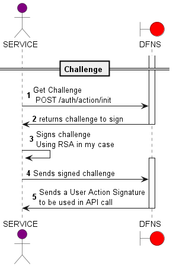
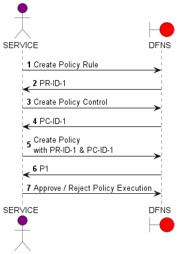
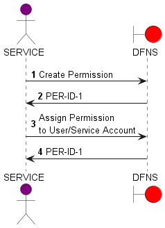

# dfns

A simple repo to demonstrate integration with [dfns](https://www.dfns.co/) using [java](https://dev.java/). 
We will use service accounts, i.e., machines to interact with dfns

## Useful Links
- [Dashboard](https://app.dfns.ninja/): to create assets, add public keys, ...
- [API](https://api.dfns.ninja): for API interaction
- [Dfns docs](https://docs.dfns.co/): official documentation
- [Typescript SDK](https://github.com/dfnsext/typescript-sdk)

## Creation of a service account
- [Generate a key pair](https://docs.dfns.co/dfns-docs/advanced-topics/authentication/credentials/generate-a-key-pair) :depending on your set-up, this would be handled by a [HSM](https://en.wikipedia.org/wiki/Hardware_security_module).

I will use [RSA](https://en.wikipedia.org/wiki/RSA_(cryptosystem)) for this part as I tend to use a cryptographic algorithm not linked to the ones used in 
public blockchains (typically [ECDSA](https://en.wikipedia.org/wiki/Elliptic_Curve_Digital_Signature_Algorithm) & [EdDSA](https://en.wikipedia.org/wiki/EdDSA)), but
obviously, either of those would work.

```shell
# Generate RSA Private Key
openssl genrsa -out rsa2048.pem 2048
# Generate the Public Key
openssl pkey -in rsa2048.pem -pubout -out rsa2048.public.pem
```

In the folder [keys](./keys) you will find both the private and public keys.

Next step is to add this public key, associated with a machine id to  [https://app.dfns.ninja/settings/service-accounts/new](https://app.dfns.ninja/settings/service-accounts/new).

Finally, we just need to make sure we can read the PEM and re-create a private key.  
See [CryptoUtils.java](./code/src/main/java/tj/dfns/security/CryptoUtils.java).

## List all service accounts: GET /auth/service-accounts

We need to provide [request headers](https://docs.dfns.co/dfns-docs/getting-started/request-headers):
- X-DFNS-APPID: ap-5cjd0-gkpc0-8vbreg28vehsungm (Under [https://app.dfns.ninja/settings/apps](https://app.dfns.ninja/settings/apps))
- X-DFNS-NONCE: a json formatted object with uuid and a time in ISO format
- The authorization bearer token

See [ListServiceAccounts](./code/src/test/java/tj/dfns/security/ListServiceAccountsTest.java) and the [result](https://gist.github.com/tjdragon/01532a8be16d9aacd83ebbe54418ab4c).

## Creation of an Ethereum Wallet on Goerli

Next step is to create an action that modifies the system's state.  
For this we will create an Ethereum wallet on Goerli.

### User Action Signing

First we need to invoke DFNS in order to get a signature associated with the call we would like to make.  
The flow looks like:



We want to create an ETH wallet, the payload is:

```json
{
  "network": "EthereumGoerli",
  "name": "tj-eth-wallet-a"
}
```

See [CreateWalletTest.java](./code/src/test/java/tj/dfns/security/CreateWalletTest.java)

## Signing summary

1. Get the challenge with no issue : See [dfns-challenge.json](./data/dfns-challenge.json)
2. From the challenge, extract: the 'challenge', the 'challengeIdentifier' and the 'key.id'
3. The next step is to build the UserActionSignature.
4. First is to create the  UserActionSignature: See [user-action-sig.json](./data/user-action-sig.json)
5. The ClientData is 'type' = 'key.get', challenge from (2) above, origin = 'http://localhost:3000', and 'crossOrigin' = false
6. Convert the ClientData into a stringified json
7. Sign (6) with the private key (SHA256withRSA)
8. ClientData is converted to base64url
9. The signature is converted to base64url
10. CredentialAssertion is created with credId from (2) 'key.id', client data from (8) and the signature from (9)
11. First Factor is created with 'kind' = 'Key' and the credential assertion (10)
12. UserActionSignature is created with the identifier (2) and the assertion (10)
13. UserActionSignature is converted to JSON and sent over
14. You should get [dfns-user-action-sig-result.json](./data/dfns-user-action-sig-result.json) back

All the steps are coded in the class [NeoDfnsInvoker](./code/src/main/java/tj/dfns/invoker/NeoDfnsInvoker.java)

## Policies 
[Policies](https://docs.dfns.co/dfns-docs/api-docs/policy-management) are a critical piece of any system: they enforce rules and set controls on actions.



## Permissions
[Permissions](https://docs.dfns.co/dfns-docs/api-docs/permissions/permissions) allows the control of API access.



### Conclusion 
That's it for now. You can re-use the code in this repo, modify it at will for your own projects.
A big thank you to [https://www.dfns.co/](https://www.dfns.co/) for allowing me to use their test env.